# UIP Architecture Deep Dive (Low-Level Design)

This document provides a detailed, low-level technical specification for the Unified Integration Platform (UIP). It expands on the high-level architecture with deep dives into implementation details, protocol specifics, data structures, and operational flows, supported by both structural flow diagrams and behavioral swimlane (sequence) diagrams.

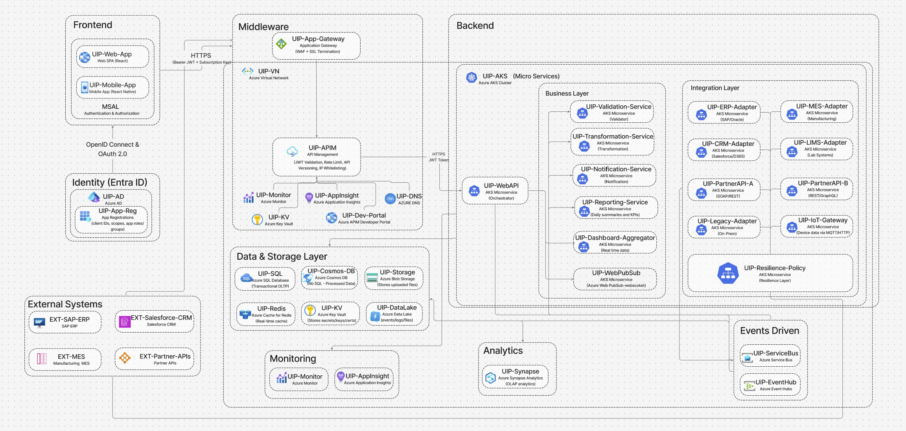
---

## 1. Frontend & Identity Layer

### Low-Level Technical Details

The frontend consists of a **Single Page Application (SPA)** built with **React** (Web) and **React Native** (Mobile). It enforces a **Zero Trust** security model where the client is considered untrusted.

*   **Library & Protocol:** Uses `@azure/msal-react` and `@azure/msal-browser` implementing **OpenID Connect (OIDC)** and **OAuth 2.0** with **Proof Key for Code Exchange (PKCE)**. This avoids exposing client secrets on the frontend.
*   **Token Lifecycle:**
    *   **ID Token:** Used by the client for UI personalization (name, email, avatar). Not sent to APIs.
    *   **Access Token:** Short-lived (e.g., 1 hour) JWT signed by Entra ID. Contains `scp` (scopes) and `roles` (app roles) claims. Sent in the `Authorization: Bearer <token>` header.
    *   **Refresh Token:** Managed securely by MSAL (in HTTP-only cookies or secure storage) to silently acquire new access tokens without user interaction until the session expires (e.g., 24 hours).
*   **Interceptors:** An Axios/Fetch interceptor automatically attaches the valid Access Token to every outgoing HTTP request targeting the `UIP-App-Gateway`. It handles 401 retries by attempting a silent token refresh.

### Flow Diagram: Frontend & Identity

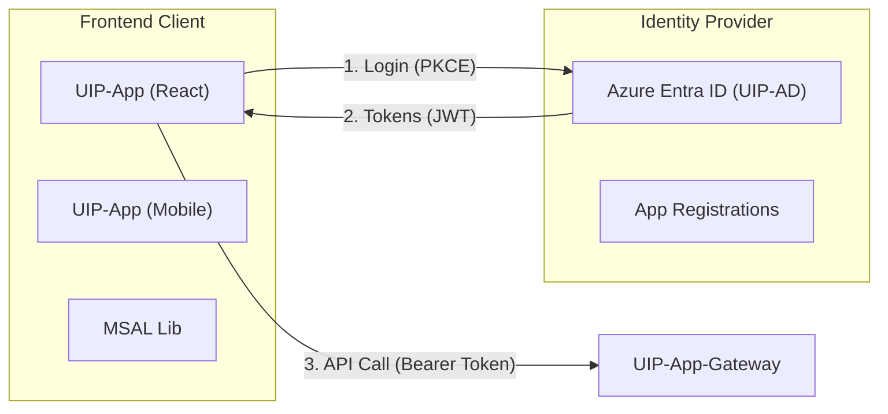

### Swimlane Diagram: Authentication & Secure API Call

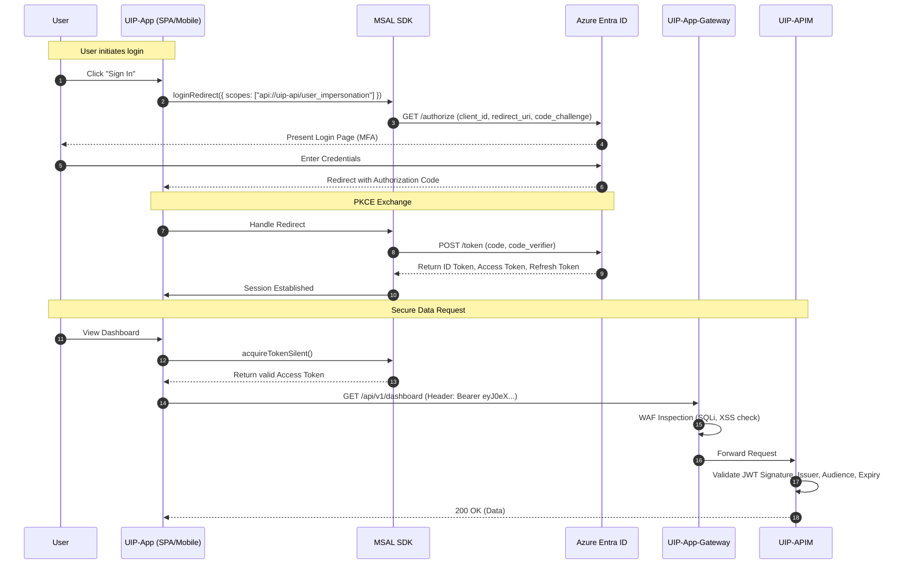

---

## 2. Middleware Layer (Gateway & APIM)

### Low-Level Technical Details

The middleware acts as the **Policy Enforcement Point (PEP)**. It decouples the frontend from backend complexity.

*   **UIP-App-Gateway (Layer 7 Load Balancer):**
    *   **SKU:** WAF_v2.
    *   **Ruleset:** OWASP Core Rule Set (CRS) 3.2 to block Top 10 vulnerabilities.
    *   **SSL Offloading:** Terminates HTTPS traffic, decrypts it, inspects it, and re-encrypts it before sending to APIM (End-to-End Encryption).
*   **UIP-APIM (API Management):**
    *   **Inbound Policies:**
        *   `validate-jwt`: Checks `aud` (audience), `iss` (issuer), and required claims (`groups`).
        *   `rate-limit-by-key`: Uses a sliding window algorithm. Key is often `context.Subscription.Id` or `context.User.Id`. Limit: 1000 calls/minute.
        *   `ip-filter`: Allow-listing for B2B partners; blocked for public internet (if internal API).
    *   **Backend Policies:**
        *   `retry`: Configured with `count="3"` and `interval="500ms"` for 5xx errors.
        *   `set-backend-service`: Dynamically routes to Blue/Green AKS deployments based on header version.
    *   **Outbound Policies:**
        *   `set-header`: Removes `X-AspNet-Version` to hide tech stack.
        *   `json-to-xml`: Legacy support if the client requires XML but backend is JSON.

### Flow Diagram: Middleware Traffic

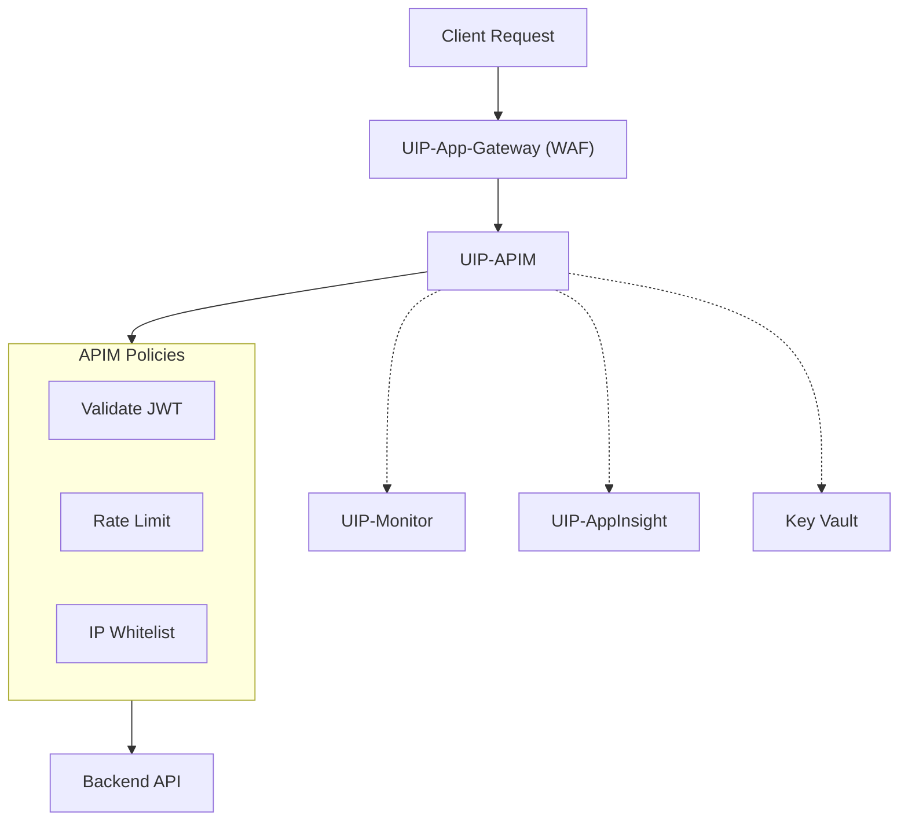

### Swimlane Diagram: Request Processing Flow

```mermaid
sequenceDiagram
    autonumber
    participant Client
    participant WAF as UIP-App-Gateway
    participant APIM as UIP-APIM
    participant Cache as APIM Redis Cache
    participant Backend as AKS Cluster

    Client->>WAF: HTTPS Request
    
    rect rgb(0, 0, 0)
        Note right of WAF: Security Edge
        WAF->>WAF: Decrypt & Inspect (OWASP)
        alt Malicious Payload
            WAF-->>Client: 403 Forbidden
        end
    end

    WAF->>APIM: Forward Request
    
    rect rgb(0, 0, 0)
        Note right of APIM: Policy Execution
        APIM->>APIM: Check Subscription Key
        APIM->>APIM: Validate JWT
        APIM->>Cache: Lookup Response Cache (key=url)
        alt Cache Hit
            Cache-->>APIM: Return Cached JSON
            APIM-->>Client: 200 OK (Cached)
        else Cache Miss
            APIM->>Backend: Forward to Microservice
            Backend-->>APIM: 200 OK (Fresh Data)
            APIM->>Cache: Store Response (TTL 60s)
            APIM-->>Client: 200 OK
        end
    end
```

---

## 3. Backend Layer (Business, Data, Eventing)

### Low-Level Technical Details

The backend is a microservices architecture running on **Azure Kubernetes Service (AKS)**.

*   **Compute (AKS):**
    *   **Nodepools:** System pool for CoreDNS/Ingress; User pool for business apps.
    *   **Autoscaling:** HPA (Horizontal Pod Autoscaler) based on CPU > 70% or Custom Metrics (KEDA) monitoring Service Bus queue depth.
    *   **Ingress Controller:** NGINX or AGIC (Application Gateway Ingress Controller).
*   **Services:**
    *   **Orchestration API:** Acts as a "BFF" (Backend for Frontend) or Saga Orchestrator. It receives the request, performs basic schema validation (FluentValidation), and publishes a command message.
    *   **Validation & Transformation:** Stateless workers that consume messages. They use **AutoMapper** for object mapping and **Liquid Templates** for complex JSON-to-JSON transformations.
*   **Data Persistence:**
    *   **Azure SQL (Hyperscale):** Stores relational "Truth" data (Orders, Customers). Uses EF Core with connection pooling.
    *   **Cosmos DB (NoSQL):** Stores "Read Models" optimized for the frontend (pre-joined JSON documents). Consistency level set to `Session` for best performance/consistency balance.
    *   **Redis Cache:** Stores reference data (Country codes, Currencies) to reduce DB load.
*   **Eventing:**
    *   **Service Bus:** Uses AMQP protocol. Messages have a `CorrelationId` (trace ID) and `Label` (event type).
    *   **Event Hubs:** Uses Kafka protocol endpoint for high-throughput ingestion (telemetry). Partitions are keyed by `TenantId` to ensure ordering within a tenant.

### Flow Diagram: Backend Services

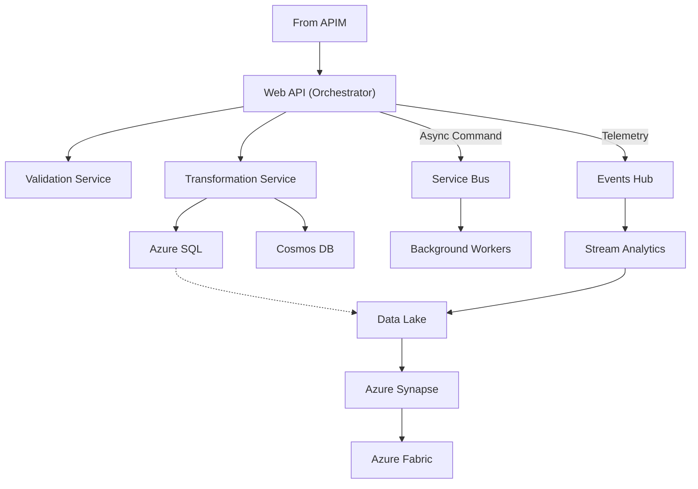

### Swimlane Diagram: Async Command Processing (Saga Pattern)

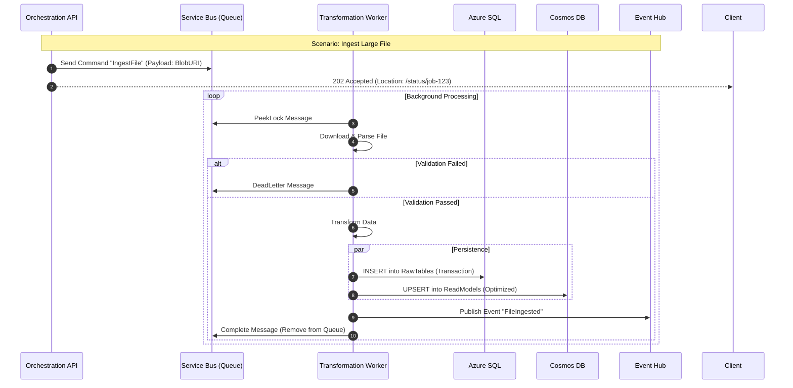

---

## 4. Integration Layer (External Systems)

### Low-Level Technical Details

This layer handles the "dirty work" of connecting to 10-15 legacy and modern external systems.

*   **Adapter Pattern:** Each external system (SAP, Salesforce, Legacy SOAP) has a dedicated microservice "Adapter". This isolates the core domain from external schema changes.
*   **Resilience (Polly Policies):**
    *   **Retry:** Wait and retry 3 times with exponential backoff (2s, 4s, 8s) for transient errors (HTTP 503, 429).
    *   **Circuit Breaker:** If 50% of requests fail within 30 seconds, "Open" the circuit for 1 minute. Fail fast without calling the external system.
    *   **Bulkhead:** Limit concurrent calls to a specific downstream system (e.g., max 10 parallel requests to SAP) to prevent resource exhaustion.
*   **Security:**
    *   **mTLS:** Adapters load client certificates from **Azure Key Vault** to authenticate with strict banking/legacy APIs.
    *   **IP Whitelisting:** Outbound traffic flows through a **NAT Gateway** to provide a static public IP that partners can whitelist.

### Flow Diagram: Integration Layer

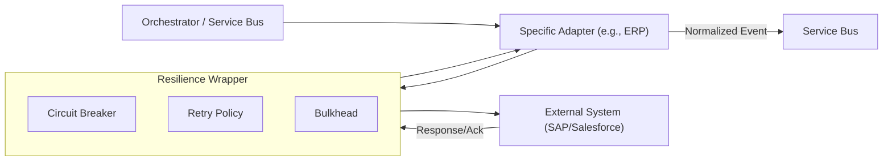

### Swimlane Diagram: Robust External Integration

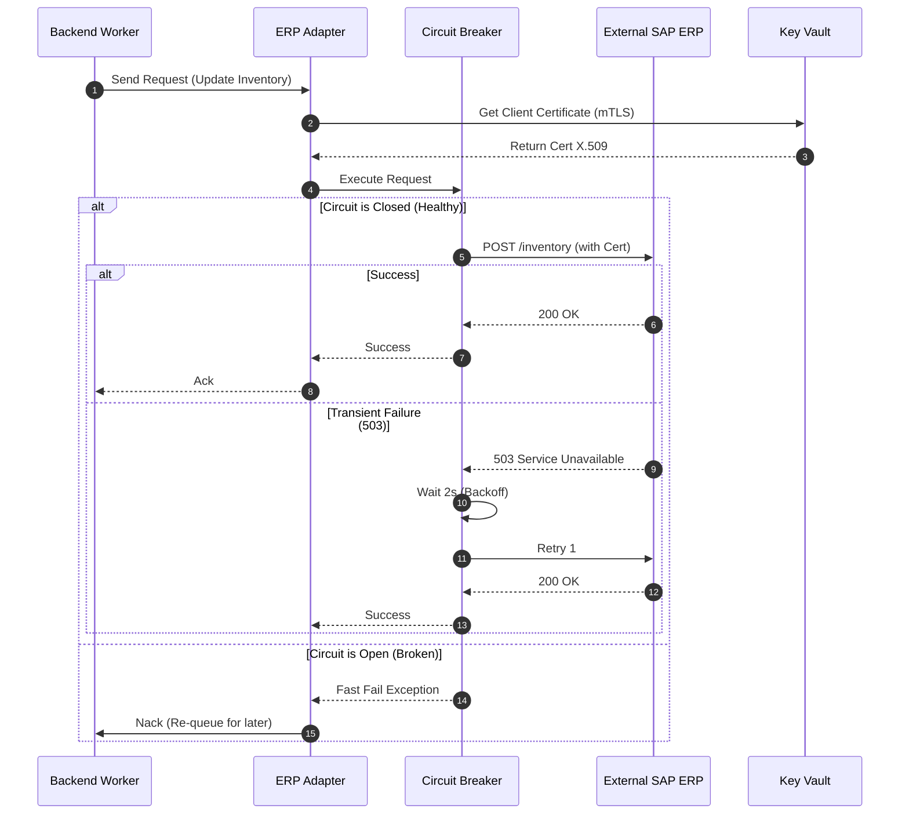

---

## 5. Analytics & Reporting Layer

### Low-Level Technical Details

This layer separates operational workloads (OLTP) from analytical workloads (OLAP) to prevent reporting queries from slowing down the app.

*   **Data Lake (ADLS Gen2):**
    *   **Bronze Zone:** Raw JSON/CSV files dumped directly from Event Hubs (Capture).
    *   **Silver Zone:** Cleaned, deduplicated, and enriched data (Delta Lake format).
    *   **Gold Zone:** Aggregated business-level tables (Star Schema) ready for reporting.
*   **Pipeline:**
    *   **Azure Synapse Pipelines:** Orchestrates the nightly batch jobs.
    *   **Spark Pools:** Performs the heavy transformation (Bronze -> Silver -> Gold).
*   **Serving:**
    *   **Serverless SQL Pool:** Allows PowerBI to query data directly from the Data Lake using T-SQL without provisioning a warehouse.

### Flow Diagram: Analytics Pipeline

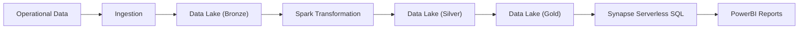

### Swimlane Diagram: Data Pipeline

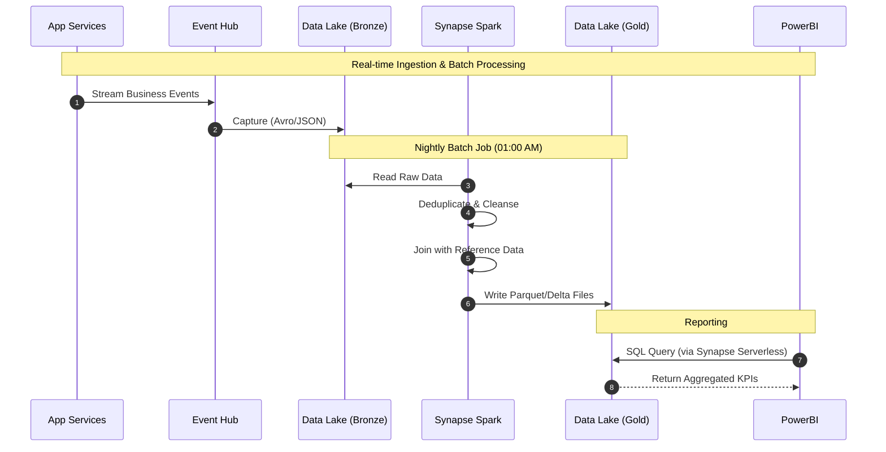

---

## 6. Network & Connectivity Architecture

A secure, segmented network foundation is critical for the UIP. The design leverages a Hub-and-Spoke model where the UIP resides in a dedicated "Spoke" VNet, peering with a central "Hub" for shared services (Firewall, ExpressRoute).

### VNet Layout & Subnets
*   **VNet Address Space:** `10.1.0.0/16` (Example)
*   **Subnet Segmentation:**
    *   `snet-agw` (10.1.1.0/24): Dedicated to Application Gateway (WAF).
    *   **`snet-apim`** (10.1.2.0/24): Dedicated to API Management (Internal Mode).
    *   **`snet-aks`** (10.1.3.0/22): Large subnet for AKS Nodes and Pods (Azure CNI networking).
    *   **`snet-pe`** (10.1.5.0/24): For Private Endpoints (SQL, Cosmos, Key Vault, Storage, Event Hubs).
    *   **`snet-db`** (10.1.6.0/24): Optional delegated subnet for Azure SQL Managed Instance (if used).

### Traffic Flow Control
*   **Ingress:**
    *   Public Internet -> Azure DDoS Protection -> App Gateway (Public IP) -> APIM (Private IP) -> AKS Ingress (Internal LB).
    *   **NSGs:** `snet-aks` only accepts traffic from `snet-apim` on port 443/80.
*   **Egress:**
    *   All outbound traffic from `snet-aks` is routed via a **NAT Gateway** attached to the subnet. This ensures a static public IP for whitelisting by external partners (Salesforce, SAP Cloud).
    *   **UDR (User Defined Routes):** Force tunnels traffic to Azure Firewall (in Hub VNet) if strict inspection is required.

### Private DNS Zones
*   Used to resolve Private Endpoint IPs internally.
*   `privatelink.database.windows.net` (SQL)
*   `privatelink.documents.azure.com` (Cosmos DB)
*   `privatelink.vaultcore.azure.net` (Key Vault)

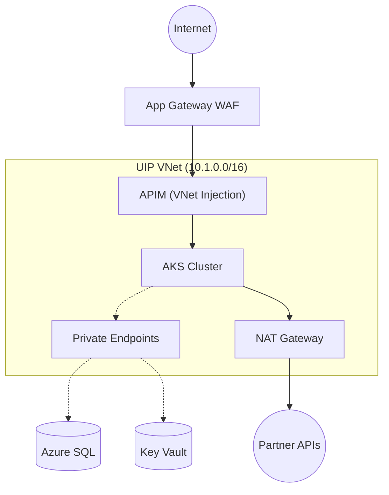

---

## 7. Security & Zero Trust Architecture

Security is baked into every layer ("Shift Left"), assuming breach and verifying explicitly.

*   **Managed Identity (Pod Identity / Workload Identity):**
    *   Eliminates connection strings in code.
    *   AKS Pods use **Workload Identity** (OIDC federation) to authenticate to Azure SQL, Cosmos DB, Service Bus, and Key Vault.
*   **Secret Management:**
    *   **Azure Key Vault** stores non-Azure secrets (e.g., Salesforce Client Secret, SAP Password).
    *   Secrets are fetched at runtime or injected via **CSI Secret Store Driver** as environment variables (mounted volume).
    *   Access policies are minimal (Get/List) and scoped to specific identities.
*   **Mutual TLS (mTLS):**
    *   **Inbound:** Optional mTLS at App Gateway for high-security B2B clients.
    *   **Outbound:** Adapters retrieve `.pfx` certs from Key Vault to authenticate with legacy bank/gov APIs.
*   **Defense in Depth:**
    1.  **Edge:** WAF (OWASP rules).
    2.  **Network:** NSGs, Private Endpoints (no public data access).
    3.  **Identity:** Entra ID + RBAC.
    4.  **Host:** AKS Node image hardening.
    5.  **Data:** TDE (Encryption at Rest) + TLS 1.3 (Encryption in Transit).

---

## 8. AKS Platform Engineering

The compute platform is designed for scale, resilience, and operational ease.

*   **Node Pools:**
    *   **System Pool:** (2 nodes) Runs CoreDNS, metrics-server, AGIC. Prevents business logic from starving system processes.
    *   **User Pool:** (3+ nodes) Runs business microservices. Autoscales up to 20 nodes based on load.
*   **Ingress Strategy:**
    *   **AGIC (Application Gateway Ingress Controller):** Reads K8s Ingress resources and automatically updates the Azure App Gateway routing rules. Removes the need for a secondary NGINX hop.
*   **Autoscaling:**
    *   **HPA:** Scales Pods based on CPU/RAM usage.
    *   **KEDA:** Event-driven autoscaler. Scales "Ingestion Workers" based on the message count in the Service Bus queue. If queue > 1000, launch 50 pods instantly.
*   **Resilience Policies:**
    *   **PDB (Pod Disruption Budget):** Ensures min 1 replica is always available during node upgrades.
    *   **Liveness/Readiness Probes:** Kills hung pods and removes initializing pods from load balancer rotation.
*   **Governance:**
    *   **Azure Policy for Kubernetes:** Enforces rules like "No Privileged Containers", "Must have resource limits", "Only pull images from trusted ACR".

---

## 9. CI/CD & Environment Strategy

We follow GitOps principles (optional) and strict environment isolation.

*   **Environments:**
    *   **Dev:** Rapid iteration, lower SKU tiers.
    *   **Staging:** Exact replica of Prod (data anonymized), used for load testing.
    *   **Prod:** High availability, locked down access.
*   **Versioning Strategy:**
    *   **Semantic Versioning:** APIs are versioned (v1, v2) in the URL path or Header.
    *   **Helm Charts:** Application manifests are packaged as Helm charts with versioned dependencies.
*   **Deployment Strategy:**
    *   **Blue-Green:** New version deployed alongside old; traffic switched at APIM or Ingress level.
    *   **Canary:** 5% of traffic routed to new version to validate KPIs before full rollout.
*   **IaC (Infrastructure as Code):**
    *   **Bicep / Terraform:** All Azure resources (AKS, SQL, VNet) are defined in code. No manual portal changes allowed ("ClickOps" forbidden).

---

## 10. Resilience, DR & High Availability

The system is designed to tolerate failures at multiple levels.

*   **Availability Zones (AZ):**
    *   AKS Nodes, SQL, Service Bus, and Storage are deployed across **3 Availability Zones** in the primary region. Protects against datacenter failure.
*   **RPO / RTO:**
    *   **RPO (Recovery Point Objective):** < 5 seconds (Geo-Replication for SQL/Cosmos).
    *   **RTO (Recovery Time Objective):** < 15 minutes (Automated failover).
*   **Disaster Recovery (DR):**
    *   **Active-Passive:** Primary region active. Secondary region (paired) receives replicated data but no traffic.
    *   **Failover:** In a regional outage, Front Door (global LB) reroutes traffic to Secondary. AKS clusters in Secondary scale up from 0 to meet demand.
*   **Data Safety:**
    *   **Soft Delete:** Enabled on Key Vault and Blob Storage (7 days) to protect against accidental deletion.
    *   **PITR (Point-in-Time Restore):** SQL backups retained for 35 days.

---

## 11. Observability & SRE

We treat operations as a software problem, using data to drive decisions.

*   **Distributed Tracing:**
    *   **W3C Trace Context:** A single `trace-id` is generated at the Edge (App Gateway/APIM) and propagated to AKS, Service Bus, and Workers.
    *   **App Insights Map:** Visualizes the full hop-by-hop latency and dependency failures.
*   **Metrics & Alerts:**
    *   **Golden Signals:** Latency, Traffic, Errors, Saturation.
    *   **Actionable Alerts:** "P1: Checkout Error Rate > 1%" (Wake up on-call). "P3: CPU > 80%" (Log ticket).
*   **SLO (Service Level Objective):**
    *   **API Availability:** 99.9% uptime per month.
    *   **Latency:** 95% of requests < 500ms.
    *   **Error Budget:** If error budget is exhausted, freeze feature deployments and focus on stability.

---

## 12. Governance & Cost Management

*   **Azure Policy:** Enforces compliance (e.g., "Allowed Regions = East US", "Require Tagging").
*   **Tagging Strategy:** All resources tagged with `CostCenter`, `Environment`, `Owner`, `Service`.
*   **Cost Controls:**
    *   **Budgets:** Alerts set at 50%, 80%, 100% of monthly budget.
    *   **Spot Instances:** Used for non-critical Dev/Test node pools to save 60% cost.
    *   **Reservations:** 1-year reserved instances for stable Prod DBs and Base Node pools.

---

## 13. End-to-End Request Flow (Consolidated)

To visualize how all layers work together, we differentiate between **Synchronous** (Read), **Asynchronous** (Write/Process), and **Real-Time** (Feedback) flows.

### Scenario A: Synchronous (Get Dashboard Data)
**Criticality:** High Latency Sensitivity.
**Flow:**
1.  **User** requests the Dashboard.
2.  **APIM** checks **Redis Cache** first.
    *   *Hit?* Return data immediately (sub-millisecond).
3.  **AKS API** (if cache miss) calls **Cosmos DB** (Read Model).
    *   *Note:* It does **not** query the heavy Azure SQL (Transactional DB) to ensure speed.
4.  **Response** is returned and cached in Redis.

### Scenario B: Asynchronous (Submit Large File/Order)
**Criticality:** High Reliability & Data Integrity.
**Flow:**
1.  **Submission**: User uploads a file/order.
2.  **Orchestrator**:
    *   Validates schema.
    *   Creates a **Job Record** in **Azure SQL** with status **`PENDING`**.
    *   Publishes a command to **Service Bus**.
    *   Returns `202 Accepted` with a `Job-ID` to the user.
3.  **Processing**:
    *   **Worker** picks up the message.
    *   Updates Azure SQL status to **`IN_PROGRESS`**.
    *   Calls **Integration Adapter** (e.g., SAP).
4.  **Completion**:
    *   Worker updates Azure SQL status to **`COMPLETED`**.
    *   Saves the final payload to **Cosmos DB** (for history).

### Scenario C: Real-Time Feedback (The "Push")
**Criticality:** User Experience (UX).
**Flow:**
1.  **Event**: When the Worker completes the job (Scenario B), it publishes a `JobCompleted` event.
2.  **WebPubSub Service**: Receives this event.
3.  **Push**: Instantly pushes a WebSocket message (`{"jobId": 123, "status": "Success"}`) to the User's active browser session.
4.  **UI Update**: The Dashboard shows a green checkmark without the user refreshing the page.

### Consolidated Sequence Diagram

```mermaid
sequenceDiagram
    participant User
    participant Edge as WAF/APIM
    participant API as Orchestrator
    participant SQL as Azure SQL (State)
    participant Bus as Service Bus
    participant Worker as Backend Worker
    participant PubSub as WebPubSub

    rect rgb(0, 0, 0)
        Note left of User: Sync Flow (Read)
        User->>Edge: GET /dashboard
        Edge->>API: Fetch Data
        API->>SQL: Query Status (Lightweight)
        API-->>Edge: Return JSON
        Edge-->>User: 200 OK
    end

    rect rgb(0, 0, 0)
        Note left of User: Async Flow (Write)
        User->>Edge: POST /upload
        Edge->>API: Submit Job
        API->>SQL: INSERT Job (Status: PENDING)
        API->>Bus: Publish "JobCreated"
        API-->>User: 202 Accepted (Job-ID)
        
        par Background Processing
            Bus->>Worker: Consume Message
            Worker->>SQL: Update Status: IN_PROGRESS
            Worker->>Worker: Execute Business Logic / External Call
            Worker->>SQL: Update Status: COMPLETED
            
            Worker->>PubSub: Publish "JobDone"
            PubSub-->>User: WebSocket Push (Refresh UI)
        end
    end
```
